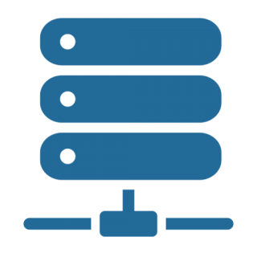

# <p align="center">  VueStack </p>

## Overview

VueStack is very simple application to interact easily with an OpenStack server using the Vue.js framework.  
With VueStack you can:

- View and create booteble volumes.
- View and upload images in different file formats.
- View and create instances (VM).

> NOTE: See the important section before using the webApp

## Project setup

```
npm install
```

### Compiles and hot-reloads for development

```
npm run serve
```

### Compiles and minifies for production

```
npm run build
```

### Lints and fixes files

```
npm run lint
```

## Important

Need to install the follow extension to allow send message to OpenStack:

- [CORS Unblock](https://chrome.google.com/webstore/detail/cors-unblock/lfhmikememgdcahcdlaciloancbhjino)

This will allow axios to read the CORS headers sent by the OpenStack server

> Don't forget to activate the plugin after installing it!
