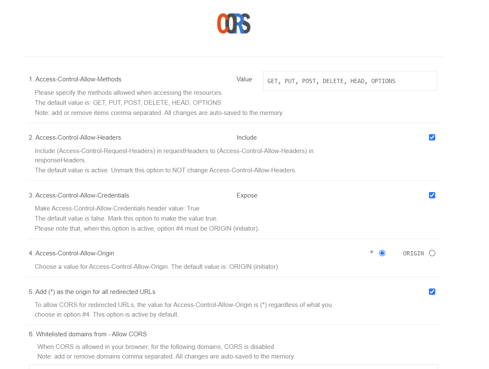

# VueStack

## Project setup

```
npm install
```

### Compiles and hot-reloads for development

```
npm run serve
```

### Compiles and minifies for production

```
npm run build
```

### Lints and fixes files

```
npm run lint
```

### Important

Need to install the follow extension to allow send message to OpenStack:

[Allow CORS: Access-Control-Allow-Origin](https://chrome.google.com/webstore/detail/allow-cors-access-control/lhobafahddgcelffkeicbaginigeejlf/related)

Is important do the following configurations in the plugin:



### Customize configuration

See [Configuration Reference](https://cli.vuejs.org/config/).
